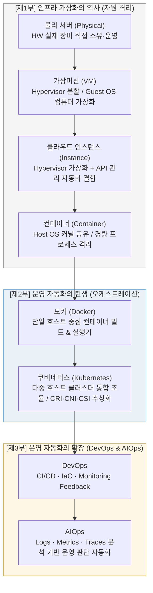
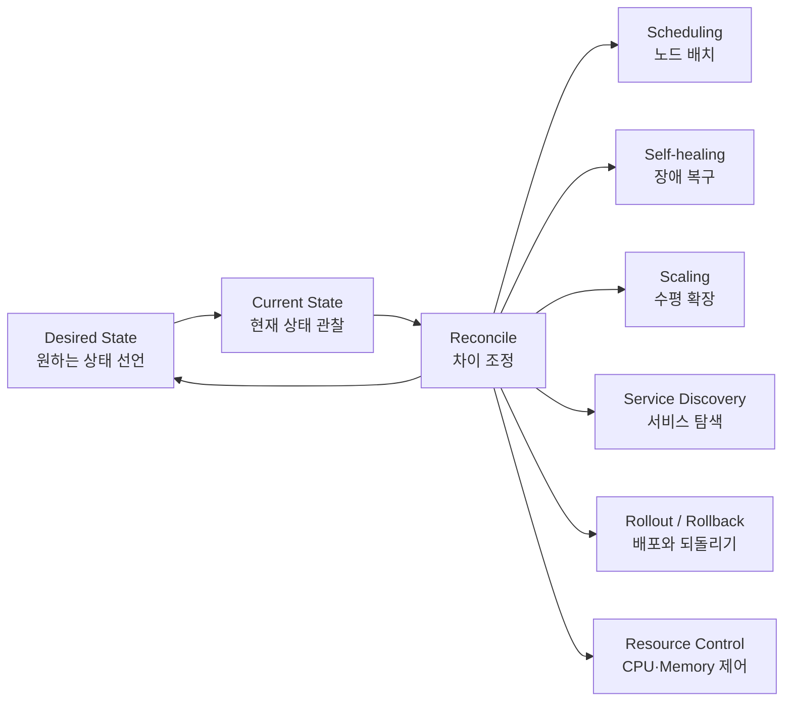
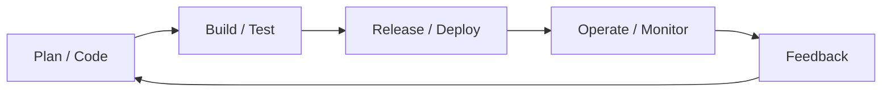
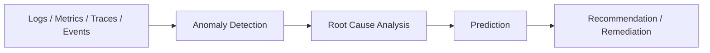

# 📖 [특강 교안] 클라우드 인프라의 진화
> 本 교안은 클라우드 가상화 기술의 발전사(물리 서버 → 가상머신 → 클라우드 인스턴스 → 컨테이너)와 분산 클러스터를 조율하는 컨테이너 오케스트레이션 플랫폼인 쿠버네티스(Kubernetes)의 핵심 설계 사상을 다룹니다. 최신 발표안 기준으로 vSphere와 Kubernetes의 오케스트레이션 대상 비교, DevOps/AIOps로 확장되는 운영 자동화 흐름, 그리고 오케스트레이션의 Desired State 제어 루프까지 함께 정리합니다.

---

## 🎯 학습 목표
1. 클라우드 컴퓨팅의 기본 구성 요소인 4대 자원(CPU, RAM, 스토리지, 네트워크)이 가상화되는 흐름을 설명할 수 있습니다.
2. 가상머신(VM)과 클라우드 인스턴스(Cloud Instance)의 제어권 및 자동화 관점에서의 차이점을 규명합니다.
3. 가상머신과 컨테이너(Container)의 아키텍처 구조적 차이점과 성능상의 장단점을 명확히 비교할 수 있습니다.
4. 컨테이너 '실행기'인 도커(Docker)와 분산 클러스터 '지휘자'인 쿠버네티스(Kubernetes)의 스코프 차이를 설명할 수 있습니다.
5. 쿠버네티스가 하부 이기종 인프라 자원을 추상화하기 위해 제공하는 3대 표준 인터페이스(CRI, CNI, CSI)를 물리 서버 인터페이스와 매핑하여 고찰할 수 있습니다.
6. 오케스트레이션 환경에서도 여전히 개발자에게 과제로 남겨진 명시적 자원 관리(Sizing)와 가용성 설계 딜레마를 분석합니다.
7. vSphere와 Kubernetes를 비교하여 VM 오케스트레이션과 컨테이너 오케스트레이션의 대상 차이를 구분합니다.
8. DevOps와 AIOps가 배포 자동화와 운영 판단 자동화로 연결되는 흐름을 설명합니다.
9. Kubernetes 오케스트레이션을 Desired State, Current State, Reconcile 관점의 자동 제어 루프로 이해합니다.

---

## 🗺️ 특강 전체 로드맵 (Lecture Roadmap)

컴퓨팅 환경의 발전은 하드웨어를 효율적으로 쪼개고 경량으로 팩킹하는 **'자원 격리 가상화'**에서 시작하여, 격리된 수많은 컴포넌트들을 유기적으로 배치하고 자동 복구하는 **'운영 오케스트레이션'**으로 진화해 왔습니다. 그 다음 단계에서는 배포 흐름을 자동화하는 **DevOps**, 운영 신호를 분석해 판단을 돕는 **AIOps**로 확장됩니다.



---

## 💻 제1부. 인프라 가상화의 역사 (VM부터 컨테이너까지)

컴퓨팅 환경의 발전사는 결국 하드웨어의 4대 물리적 자원(**CPU, RAM, Storage, Network**)을 가상화 계층을 거쳐 사용자에게 어떻게 분배하고 효율적으로 격리하여 제공하느냐의 가상화 역사입니다.

### 1. 가상머신(VM) vs 클라우드 인스턴스(Instance)의 실체적 차이
흔히 클라우드 가상 서버를 가상머신(VM)과 동일하게 혼용하지만, 컴퓨터 아키텍처 및 시스템 엔지니어링 관점에서는 명확한 설계상 차이가 존재합니다.

*   **가상머신 (Virtual Machine - 인프라 수준)**:
    *   **개념**: 하나의 물리 하드웨어 위에 하이퍼바이저(Hypervisor)를 직접 설치하여 리소스를 분할하고 독립된 Guest OS를 구동하는 가상화의 '기술적 실체'입니다.
    *   **제어 수준**: 관리자가 하이퍼바이저 셋업, 가상 CPU/RAM 수동 할당, 가상 디스크 포맷(vmdk, qcow2 등), 가상 NIC 매핑, OS 설치 및 가상 드라이버 설정을 직접 수동으로 제어해야 하므로, 유연성이 상대적으로 낮습니다. (예: 사내 서버실에 VMware ESXi나 KVM을 깔아 VM을 만드는 작업)
*   **클라우드 인스턴스 (Cloud Instance - API 수준)**:
    *   **개념**: 기술적 가상화 실체는 Hypervisor 기반의 가상머신(VM)과 동일하지만, 클라우드 제공업체(AWS, GCP 등)가 **"대규모 제어 및 프로비저닝 자동화 API (Control Plane)"**를 씌워 완벽히 추상화한 형태입니다.
    *   **차이점**:
        1.  **API 기반 온디맨드 제어**: 하이퍼바이저 수준을 의식하지 않고 마우스 클릭이나 CLI 명령(API 호출) 단 한 번으로 수 분 내에 가상 서버를 가동합니다.
        2.  **디커플링(Decoupling)**: 컴퓨터 본체와 스토리지(EBS 등 블록 스토리지), 가상 네트워크 인터페이스(vNIC), 방화벽(보안 그룹)이 완전히 분리되어 있어 기동 중에 유기적으로 부착 및 분리가 가능합니다.
        3.  **탄력적 오토스케일링**: 모니터링 API(CloudWatch 등)와 결합하여 트래픽에 맞춰 실시간으로 수십, 수백 대의 인스턴스를 자동 증설 및 소멸(Elasticity)할 수 있습니다.

### 2. 가상머신(VM) vs 컨테이너(Container) 구조적 비교
*   **VM**: **"컴퓨터"**를 가상화합니다. 무거운 Guest OS가 구동되어 시작에 수 분이 걸리며 상당한 시스템 리소스 오버헤드를 가집니다.
*   **Container**: OS를 가상화하는 대신, **"프로세스"**를 격리합니다. Guest OS가 없이 호스트의 OS Kernel을 공유하며 리눅스 커널의 `Namespace`(격리)와 `cgroup`(자원 제한) 제어 기술을 통해 구동되어 수 밀리초(ms) 만에 즉시 실행됩니다.

| 비교 항목 | 가상머신 (Virtual Machine) | 컨테이너 (Container) |
| :--- | :--- | :--- |
| **추상화 대상** | **컴퓨터** 전체를 가상화 | **프로세스** 애플리케이션 격리 |
| **운영체제(OS)** | 각 VM마다 무거운 **Guest OS** 탑재 | Guest OS 없음, **Host OS 커널 공유** |
| **자원 격리 방식** | 하이퍼바이저(Hypervisor) 논리 격리 | 리눅스 Namespace / cgroup 격리 |
| **메모리 오버헤드** | OS 구동으로 인해 기본 수 GB 소모 | 격리 프로세스 구동에 필요한 수 MB만 소모 |
| **기동 속도** | OS 부팅 프로세스로 인해 **수 분 소요** | OS 부팅이 불필요하여 **수 밀리초(ms) 소요** |
| **스토리지 방식** | 독립된 고정 크기 가상 디스크 파일 | 효율적인 **유니온 파일 시스템 (UnionFS)** 공유 |

---

## ⚙️ 제2부. 운영 자동화와 컨테이너 오케스트레이션

### 1. 도커(Docker) vs 쿠버네티스(Kubernetes) 차이
컨테이너 기반 인프라를 다룰 때 가장 많이 혼동하는 개념이지만, 둘은 담당하는 **영역(Scope)과 스케일(Scale)**이 완전히 다른 상호보완적 관계입니다.

*   **도커 (Docker) - "단일 호스트(컴퓨터) 내부의 컨테이너 빌더 & 실행기"**:
    *   **역할**: 개발한 애플리케이션 코드를 독립된 컨테이너 이미지로 포장(Build)하고, **단 하나의 서버 내부**에서 컨테이너를 구동(Run), 중지, 삭제하는 도구입니다.
    *   **한계**: 서버 장비가 여러 대(Multi-node)로 확장되면 도커 단독으로는 *"어느 서버의 자원이 남는지 분석하여 컨테이너를 지능적으로 분산 배치"* 하거나, *"장애가 난 노드의 컨테이너를 다른 노드로 자동 이사시키기(Scheduling)"*, *"여러 서버에 흩어진 컨테이너 간의 통신"* 등을 자동 제어할 수 없습니다.
*   **쿠버네티스 (Kubernetes) - "다중 호스트(클러스터)의 분산 컨테이너 오케스트레이터"**:
    *   **역할**: 여러 대의 물리/가상 서버를 하나의 거대한 가상의 컴퓨팅 자원 풀(클러스터)로 통합하고, 그 위에서 수천 개의 컨테이너들의 분산 배치, 장애 자동 복구(Self-healing), 동적 로드밸런싱, 수평 확장(Auto-scaling)을 총괄 관리하는 **인프라의 중앙 사령탑(두뇌)**입니다.
    *   *비유*: 도커가 악기 소리를 내는 개별 **바이올린 연주자**라면, 쿠버네티스는 수많은 연주자들의 템포와 위치를 지휘하여 웅장한 교향곡을 완성하는 **오케스트라 지휘자**입니다.

### 2. 고급 아키텍처: 쿠버네티스의 인프라 추상화와 3대 표준 인터페이스
컴퓨터 운영체제(OS)가 하드웨어를 추상화하기 위해 디바이스 드라이버 규격을 정의하듯, **쿠버네티스는 분산 클러스터 인프라를 추상화**하기 위해 3대 핵심 표준 인터페이스 규격을 제공합니다.

이 인터페이스 규격 덕분에 쿠버네티스는 하부 인프라(물리 장비 종류, 가상화 환경 종류)에 종속되지 않고 완벽하게 이식 가능한 분산 시스템을 구축할 수 있습니다.

```
       ┌─────────────────────────────────────────────────────────┐
       │                       쿠버네티스                        │
       └──────────────────────────┬──────────────────────────────┘
              ┌───────────────────┼───────────────────┐
              ▼                   ▼                   ▼
           [ CRI ]             [ CNI ]             [ CSI ]
      런타임 인터페이스   네트워크 인터페이스   스토리지 인터페이스
              │                   │                   │
         containerd            Calico              AWS EBS
           CRI-O               Flannel              Ceph
       (컨테이너 구동)      (가상 네트워크)       (디스크 볼륨)
```

1.  **CRI (Container Runtime Interface - 컴퓨팅 가상화 추상화)**:
    *   **개념**: 컨테이너의 생성, 실행, 삭제를 담당하는 엔진과의 통신 규격을 인터페이스화한 것입니다.
    *   **역할**: 과거 도커 전용이었던 결합을 깨고, `containerd`, `CRI-O` 등 표준 OCI 규격을 따르는 다양한 경량 컨테이너 런타임 엔진을 플러그인 형태로 유연하게 교체 및 연동할 수 있게 합니다.
2.  **CNI (Container Network Interface - 네트워크 가상화 추상화)**:
    *   **개념**: 컨테이너가 생성될 때 가상 네트워크 인터페이스를 연결하고 IP 주소를 할당하는 통신 규격입니다.
    *   **역할**: 서로 다른 물리 서버에 구동 중인 컨테이너들이 마치 하나의 동일 네트워크 대역에 존재하는 것처럼 연결해 줍니다. Calico, Flannel, AWS-VPC CNI 등 다양한 고성능 가상 네트워크 플러그인을 결합할 수 있습니다.
3.  **CSI (Container Storage Interface - 스토리지 가상화 추상화)**:
    *   **개념**: 컨테이너가 데이터를 영구 보존하기 위해 외부 스토리지 볼륨을 마운트하고 분리하는 스토리지 드라이버 인터페이스 규격입니다.
    *   **역할**: 이기종 스토리지 벤더들이 직접 드라이버를 개발해 쿠버네티스에 붙일 수 있게 합니다. (예: AWS EBS, Google Persistent Disk, 사내 NFS, 오픈소스 Ceph 분산 스토리지 등을 코드 수정 없이 볼륨에 장착).

#### 📊 물리 서버 vs Hypervisor 가상화 vs 쿠버네티스 표준 인터페이스 매핑 비교

| 분류 | 물리 서버 (하드웨어 수준) | 전통 가상화 (VM / Hypervisor) | 쿠버네티스 표준 인터페이스 규격 |
| :--- | :--- | :--- | :--- |
| **컴퓨팅 가상화** | 물리 CPU 및 RAM 소켓, 메인보드 | vCPU 할당, 하이퍼바이저 에뮬레이션 | **CRI (Container Runtime Interface)**<br>• Docker/containerd 기반 경량 컨테이너 실행 추상화 |
| **네트워크 가상화** | 물리 랜카드(NIC), UTP 선, L2/L3 스위치 | 가상 랜카드(vNIC), 하이퍼바이저 가상 스위치 | **CNI (Container Network Interface)**<br>• Calico/Flannel 기반 컨테이너 오버레이 가상 네트워크 구축 |
| **스토리지 가상화** | 물리 HDD / SSD, SATA/SCSI 컨트롤러 | 가상 디스크 파일(.vmdk 등), 가상 컨트롤러 | **CSI (Container Storage Interface)**<br>• AWS EBS/NFS 등 이기종 영구 저장소 볼륨 연동 추상화 |

---

## 🧭 심화 비교. vSphere와 Kubernetes: 오케스트레이션 대상의 차이

오케스트레이션은 Kubernetes만의 개념이 아닙니다. 핵심은 **무엇을 조율하는가**입니다. 전통 가상화 환경에서는 vSphere가 여러 ESXi 호스트 위의 VM을 배치하고 복구하는 운영 자동화 계층 역할을 해 왔고, 클라우드 네이티브 환경에서는 Kubernetes가 여러 Worker Node 위의 Pod와 Container를 배치하고 확장합니다.

| 비교 항목 | vSphere / VM Orchestration | Kubernetes / Container Orchestration |
| :--- | :--- | :--- |
| **오케스트레이션 대상** | Virtual Machine | Pod / Container |
| **실행 기반** | ESXi Host, Hypervisor | Worker Node, Container Runtime |
| **관리 계층** | vCenter | Control Plane |
| **핵심 기능** | VM 배치, HA, vMotion, DRS, 리소스 풀 관리 | Scheduling, Self-healing, Scaling, Service Discovery |
| **운영 관점** | Guest OS를 포함한 가상 컴퓨터 단위 운영 | 애플리케이션 실행 단위와 배포 상태 중심 운영 |

정리하면 vSphere는 **VM 세계의 운영 자동화 계층**, Kubernetes는 **컨테이너 세계의 운영 자동화 계층**입니다. 두 시스템 모두 클러스터 전체를 보고 배치와 복구를 수행하지만, vSphere는 VM을 다루고 Kubernetes는 Pod/Container를 다룬다는 차이가 있습니다.

---

## 🚦 쿠버네티스와 자원 관리: 자동화 이후에도 남는 책임

Kubernetes는 컨테이너 배포를 자동화하지만, 자원의 경계까지 스스로 완벽히 결정하지는 않습니다. 개발자와 운영자는 YAML에 컨테이너가 필요로 하는 최소 자원과 최대 자원을 명시해야 합니다.

```yaml
resources:
  requests:
    cpu: 500m
    memory: 512Mi
  limits:
    cpu: "1"
    memory: 1Gi
```

*   **requests**: 스케줄러가 배치 판단에 사용하는 최소 보장 자원입니다. 예를 들어 `cpu: 500m`은 0.5 코어를 의미합니다.
*   **limits**: 컨테이너가 사용할 수 있는 최대 자원 경계입니다. 너무 낮게 잡으면 OOM(Out of Memory)이나 성능 저하가 발생할 수 있고, 너무 높게 잡으면 비용과 자원 낭비가 커집니다.
*   **핵심 딜레마**: 오케스트레이션은 배치와 복구를 자동화하지만, 서비스 특성에 맞는 Sizing과 가용성 판단은 여전히 설계자의 책임입니다.

---

## 🔁 오케스트레이션이 자동화하는 것: Desired State 제어 루프

컨테이너 오케스트레이션의 본질은 컨테이너를 한 번 실행하는 것이 아니라, 전체 시스템의 상태를 사용자가 선언한 **원하는 상태(Desired State)**에 계속 맞추는 것입니다.



Kubernetes는 사용자가 선언한 Deployment, Service, HPA 같은 리소스를 기준으로 현재 클러스터 상태를 계속 관찰합니다. 차이가 발생하면 Control Plane이 스케줄링, 재시작, 재배치, 확장, 라우팅 변경, 롤아웃/롤백을 수행해 원하는 상태에 다시 가까워지도록 조정합니다.

---

## 🛠️ 제3부. DevOps와 AIOps: 운영 자동화의 확장

Kubernetes가 컨테이너 배치와 복구를 자동화한다면, DevOps와 AIOps는 운영 자동화의 범위를 더 넓힙니다. DevOps는 변경 사항을 빠르고 안전하게 운영 환경까지 보내는 흐름을 자동화하고, AIOps는 운영 중 발생하는 방대한 신호를 분석하여 장애 감지와 대응 판단을 돕습니다.

### 1. DevOps: 코드에서 운영까지 이어지는 자동화 루프

DevOps는 단순한 도구 묶음이 아니라, 개발과 운영 사이의 지연을 줄이는 문화이자 자동화 체계입니다.



*   **CI/CD**: 변경 사항을 반복 가능하게 빌드, 테스트, 배포합니다.
*   **IaC(Infrastructure as Code)**: 인프라 구성을 코드처럼 선언하고 버전 관리합니다.
*   **Monitoring Feedback**: 운영 상태를 다시 개발 의사결정으로 연결합니다.

### 2. AIOps: 관측 데이터에서 운영 판단 자동화로

AIOps는 운영자를 대체하는 개념이 아니라, 사람이 모두 해석하기 어려운 로그, 메트릭, 트레이스, 이벤트를 분석해 장애 징후와 원인 후보를 빠르게 좁혀 주는 운영 지능화 계층입니다.



*   **Anomaly Detection**: 정상 패턴에서 벗어난 이상 징후를 감지합니다.
*   **Root Cause Analysis**: 여러 이벤트의 상관관계를 분석해 장애 원인 후보를 좁힙니다.
*   **Recommendation / Remediation**: 조치 후보를 추천하거나, 정책과 승인 절차 안에서 제한적으로 자동 조치를 수행합니다.

### 3. DevOps와 AIOps의 연결

DevOps와 AIOps는 경쟁 개념이 아닙니다. DevOps가 **배포 자동화의 루프**라면, AIOps는 **운영 판단 자동화의 루프**입니다. 둘이 연결되면 변경을 빠르게 배포하고, 운영 신호를 분석해 다시 개선으로 돌려보내는 더 강한 피드백 시스템이 됩니다.

| 구분 | DevOps | AIOps |
| :--- | :--- | :--- |
| **초점** | 변경 사항을 안전하게 배포 | 운영 신호를 분석해 판단 지원 |
| **주요 입력** | 코드, 설정, 인프라 선언 | 로그, 메트릭, 트레이스, 이벤트 |
| **핵심 자동화** | CI/CD, IaC, Release Automation | 이상 탐지, 이벤트 상관 분석, 원인 분석 |
| **결과** | 빠르고 반복 가능한 배포 | 빠른 감지, 원인 후보 축소, 대응 추천 |

---

## 📝 자가 학습 퀴즈 (Self-Review Quiz)

1.  **Q1**: 가상머신(VM)과 클라우드 인스턴스(Cloud Instance)의 '자동화 및 탄력성' 관점에서의 본질적인 차이는 무엇인가요?
    *   *A1*: VM은 가상화를 구현하는 기술적 실체로서 관리자가 수동으로 가상 자원을 할당하고 OS를 설치 및 운영해야 하지만, 클라우드 인스턴스는 대규모 관리 자동화 API 계층(Control Plane)이 결합되어 마우스 클릭이나 API 호출 한 번으로 스토리지와 네트워크 디커플링 및 동적 오토스케일링을 완전 자동 제어할 수 있습니다.
2.  **Q2**: "도커(Docker)만으로는 대규모 MSA(마이크로서비스 아키텍처) 인프라를 운영할 수 없다"고 하는 기술적인 원인은 무엇인가요?
    *   *A2*: 도커는 단일 호스트 내부의 컨테이너 생명주기만 제어할 수 있는 실행기이기 때문입니다. 대규모 MSA 환경에서는 여러 대의 서버(멀티 노드)에 컨테이너가 분산 배치되어 서로 통신해야 하고 노드 장애 시 다른 서버로 자동 복구 및 스케줄링이 되어야 하는데, 이 클러스터 단위의 분산 통합 조율은 오케스트레이터인 쿠버네티스만 가능합니다.
3.  **Q3**: 쿠버네티스가 이기종 분산 클러스터 자원을 제어할 때 CRI, CNI, CSI 3대 표준 인터페이스를 제공하는 이유와 아키텍처적 의의를 설명하시오.
    *   *A3*: 일반 운영체제(OS)가 하드웨어를 추상화하듯, 쿠버네티스는 하부의 이기종 클라우드 환경 및 물리적 자원에 구애받지 않고 유연하게 확장 가능하도록 컴퓨팅(CRI), 네트워크(CNI), 스토리지(CSI) 가상 자원을 공통 표준 인터페이스로 완벽히 추상화하여 의존성을 디커플링하기 때문입니다.
4.  **Q4**: vSphere와 Kubernetes는 모두 오케스트레이션 계층이라고 볼 수 있습니다. 두 시스템의 가장 중요한 차이는 무엇인가요?
    *   *A4*: 가장 중요한 차이는 오케스트레이션 대상입니다. vSphere는 ESXi/Hypervisor 위의 VM을 배치, 이동, 복구하는 VM 오케스트레이션 계층이고, Kubernetes는 Worker Node 위의 Pod/Container를 배치, 확장, 복구하는 컨테이너 오케스트레이션 계층입니다.
5.  **Q5**: Kubernetes에서 Desired State, Current State, Reconcile은 각각 무엇을 의미하나요?
    *   *A5*: Desired State는 사용자가 YAML 등으로 선언한 원하는 운영 상태이고, Current State는 클러스터가 실제로 관찰한 현재 상태입니다. Reconcile은 두 상태의 차이를 줄이기 위해 Control Plane이 배치, 복구, 확장, 라우팅, 롤아웃 등을 수행하는 조정 과정입니다.
6.  **Q6**: DevOps와 AIOps는 어떤 관계인가요?
    *   *A6*: DevOps는 코드 변경을 빌드, 테스트, 배포하고 운영 피드백을 다시 개발로 돌리는 배포 자동화 루프입니다. AIOps는 운영 중 발생하는 로그, 메트릭, 트레이스, 이벤트를 분석해 이상 탐지, 원인 분석, 조치 추천을 수행하는 운영 판단 자동화 루프입니다. 둘은 경쟁 개념이 아니라 자율 운영에 가까워지기 위해 연결되는 보완적 흐름입니다.
